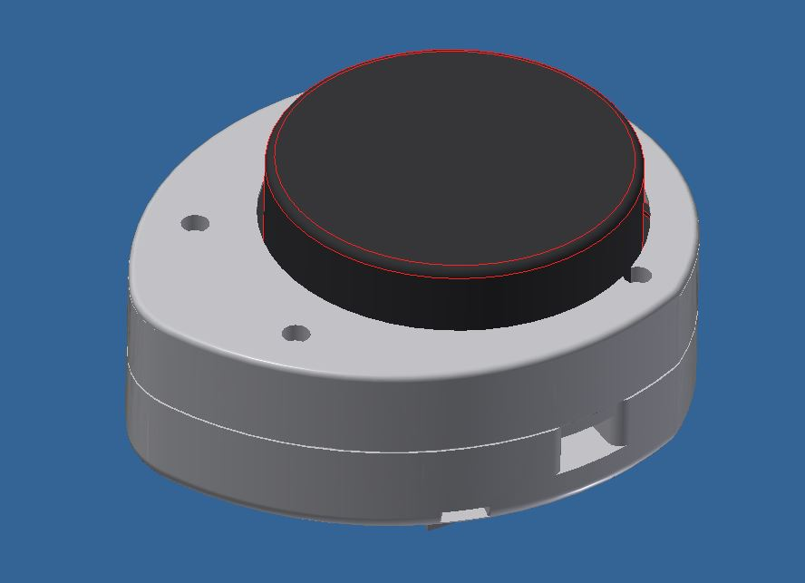
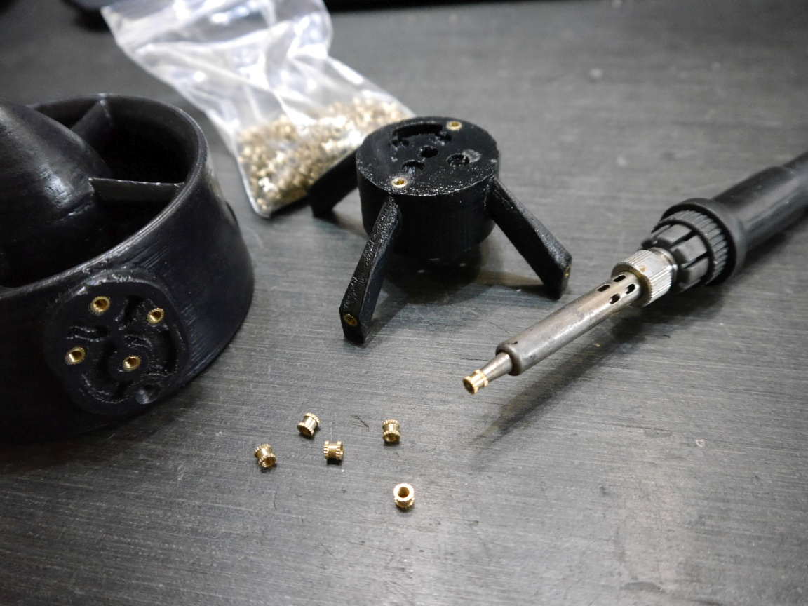

# LIDARsee v2 Enclosure

Design is done in _Autodesk Inventor 2016_

/stp files for 3D printing, we used standard ABS and a common FDM-3D-Printer (reprap) for all parts of the construction

* _Lidarsee_v2.iam_ - main assembly
* _Lidar.ipt_ and _Lidar_v2.ipt_ are rough models of the _XV-11 LIDAR Module_
* There is also a mockup of the PCB available

## Brass Insert Nut
For the installation we used brass insert nuts which we mounted by using an old soldering iron. 

