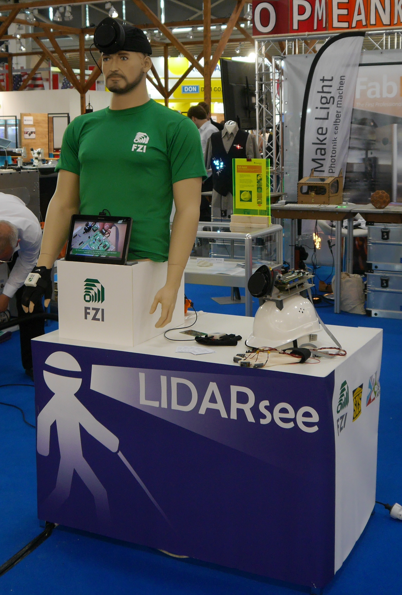

# LIDARsee v2 Hardware 

A good summary of the _Neato XV-11 LIDAR module_ can be found at:  
http://blog.tkjelectronics.dk/2014/08/handheld-xv-11-lidar-with-stm32f429-and-matlab/

## License
Hardware license: Creative Commons CC0
https://creativecommons.org/publicdomain/zero/1.0/legalcode

Software license: MIT License

