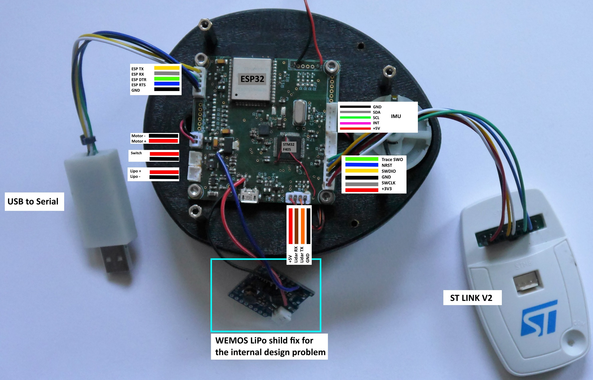

# lidarsee_v2_hardware
Motherboard_STM32F405RG_r1 ist the mainboard for the head unit. 

### Features
* XV-11 lidar compatible
* STM32F405 microprocessor
* ESP32 WiFi/bluetooth-module
* Single cell lipo power supply
* MPU6050 IMU
* We used a single cell 2500mAh LiPo battery

### To Do
* Rework of the LiPo Boost converter (larger inductor?)
* IMU not tested, it is recommended to use an external IMU connected to the I2C port. Soldering the IMU by hand is quite difficult and there are a lot of cheap reliable breakout boards available. For example the BNO055 sensor also delivers easy-to-use Euler's Angles.
* Using parts that can be soldered by hand easierly

## Wiring

